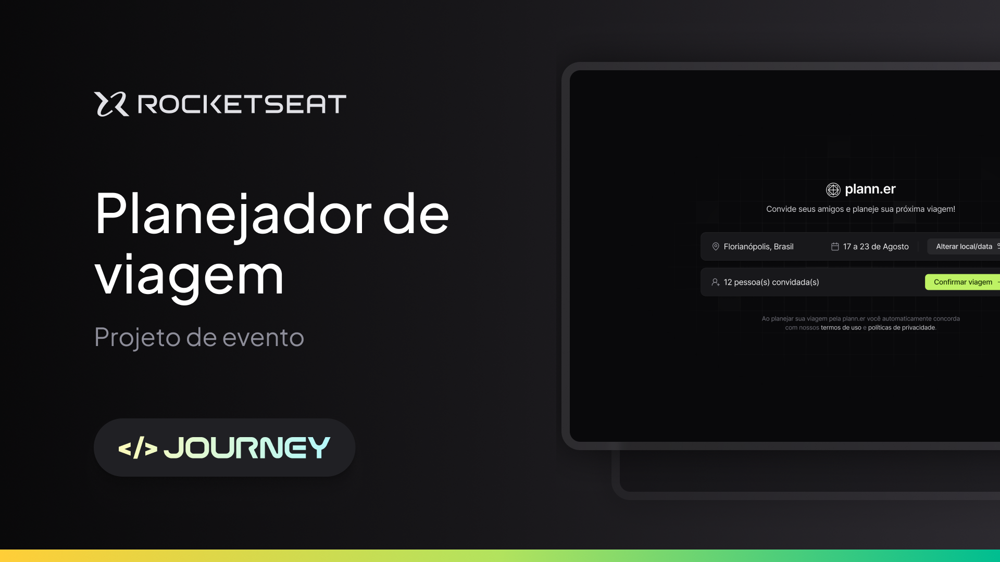

# NLW Journey (React)

Essa aplicação foi desenvolvida durante o NLW Journey da Rocketseat utilizando React.js, TypeScript, Tailwind.

## Executando

Após clonar o repositório, acesse a pasta do projeto e execute os comandos abaixo:

```sh
npm install
npm run dev
```

Acesse http://localhost:5173 para visualizar a aplicação.